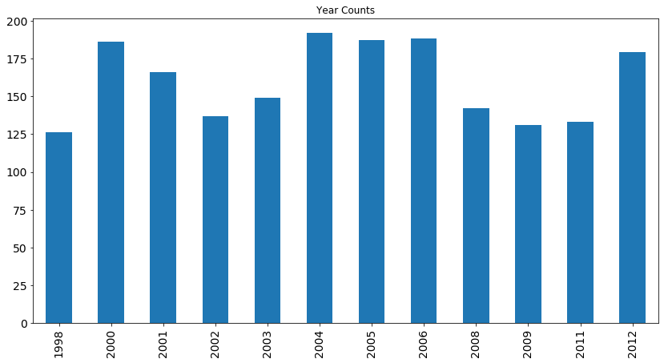

# NLP Unsupervised Learning Case Study

## Introduction

What types of interesting data can we pull from a website which compiles and tracks people's accounts of bigfoot sightings?

## Data Cleaning and Gathering

The Geographic Database of Bigfoot / Sasquatch Sightings & Reports (http://www.bfro.net/gdb/) contained our data. We had a json data file with the contents of the website and we used beautiful soup to scrape the contents of individual reports (example report: http://www.bfro.net/GDB/show_report.asp?id=13038) to build a pandas dataframe, which could then be used for Natural Language Processing.

First, we examined the example report and discussed which information we wanted to extrapolate, and how we envisioned our pandas dataframe to look like.

We looked at including the keywords, but they were the same for every article. Since they are the same, we decided that they wouldn't help differentiate any given article from another one. Therefore, we did not include any keywords in our analysis. We used Beautiful Soup to parse out the html and the content within each article that would make up our corpus. We also decided to parse out the following items to have in our cleaned data set:

1. Year
2. Season
3. Month
4. State
5. Country
6. Content (freeform entry by sighter)

The bulk of our analysis is done on the contents section, since this is where the person who reported the sighting is free forming their own answer. By analyzing hundreds of sighting documentations, we felt like we may be able to look at interesting trends and structure in otherwise unstructured data.

## Exploratory Data Analysis

After making our corpus of documents containing each report from the sample data set (100 reports), we had a look at a word cloud of the most frequent terms to get a sense of our sample corpus (which was someone representative of the entire dataset). We applied a stopwords list that contained the default english stopwords as well as some additional words we thought to be extraneous such as: 
```bash
'just', 'like', 'did', 'time', 'saw', 'right', 'left', 'road', 'county', 'year', 'road','said', 'area', 'nt','woods', 'heard', '2009', '2012', '2011', '2013', '2009', 'km','07', '09', 'didnt', 'got', 'went', 'know'
```
Also, we added all of the counties, years, seasons, months, and states to our stop words. Since the report is free form, there were several iterations of the same thing (ie 2009 vs 09, or 'sometime between 2008 and 2009'). We spent some time working on our stop words in order to emphasize unique topics.

Here's an idea of the distribution of words in a sample dataset:


Here's the distribution of the seasonality of the entire dataset:


Here's the monthly distribution on the entire dataset:


Here's the yearly distribution on the entire dataset:



Here's the distribution of states on the entire dataset:


## Analysis

After we cleaned and explored our visualizations, we then used a CountVectorizer and Latent Dirichlet Allocation (LDA) to explore our topics. LDA is a popular tool for text analysis, because it provides a predicitve and latent topic representation of the corpus. It is generally difficult to evaluate assumptions due to its unsupervised training process.  There is no gold standard list of topics to compare.  But, it is still important to identify if the model was good or bad. We used an eyeballing approach to see if the topics made sense. Additionally, we looked at the perplexity metric, which is widely used for language model evaluation. It describes how "surprised" a model is of new data. The downside of optimizing for perplexity is that it may not yield human interpretable topics.

Additionally, we tried to lemmatize our data which regresses words back to their root. However, we experienced a lot of difficulty implementing this into our code.

## Results

| Topic 1 | Topic 2 | Topic 3 | Topic 4 | Topic 5 |
| ----------- | ----------- | ----------- | ----------- | ----------- | 
| expedition | night | alberta | creature | symposium |
| florida | sound | marina | hair | producer |
| north | lake | 82 | looked | rt |
| organizer | large | cottage | feet | raymond |
| texas | away | lewis | tall | glen |
| carolina | tree | footage | seen | oln |
| bc | forest | woop | animal | dvd |
| peninsula | day | feild | witness | darrington |
| bfro | feet | hut | sighting | director |
| wa | trees | coola | head | grandson |

* Topic 1: Location

* Topic 2: Environment/Where people are when they encounter Bigfoot

* Topic 3: Location type

* Topic 4: Description of Bigfoot

* Topic 5: Film/Video capturing Bigfoot

The topics themselves do not carry any weighting over another. The words are displayed in the highest probability.

Putting a human interpretation on the topic description sometimes feels like a reach, but there are some noticeable trends in each category.

## Conclusion

In conclusion, aside from organizing our unsupervised dataset into some structured topics, we learned that it is very difficult to work with freeform data. Additionally, it is very computationally expensive to run the LDA as well.

One of the biggest takeaways we had, is if you decide to set up a form to allow for input from users it would be very beneficial to force users to select only certain values when appropriate. For example the January month could be input as Jan, january, 1, 01, January, and any number of misspellings. 

For the future, we would like to continue to work on our Lemmatizer and also compare our results to a Non Negative Matrix Factorization.
